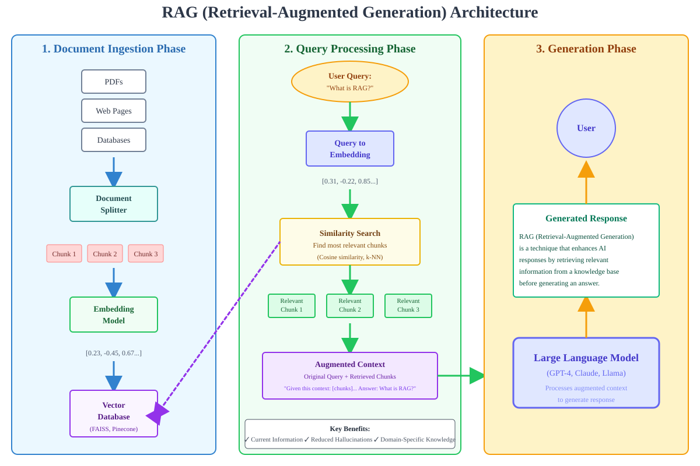
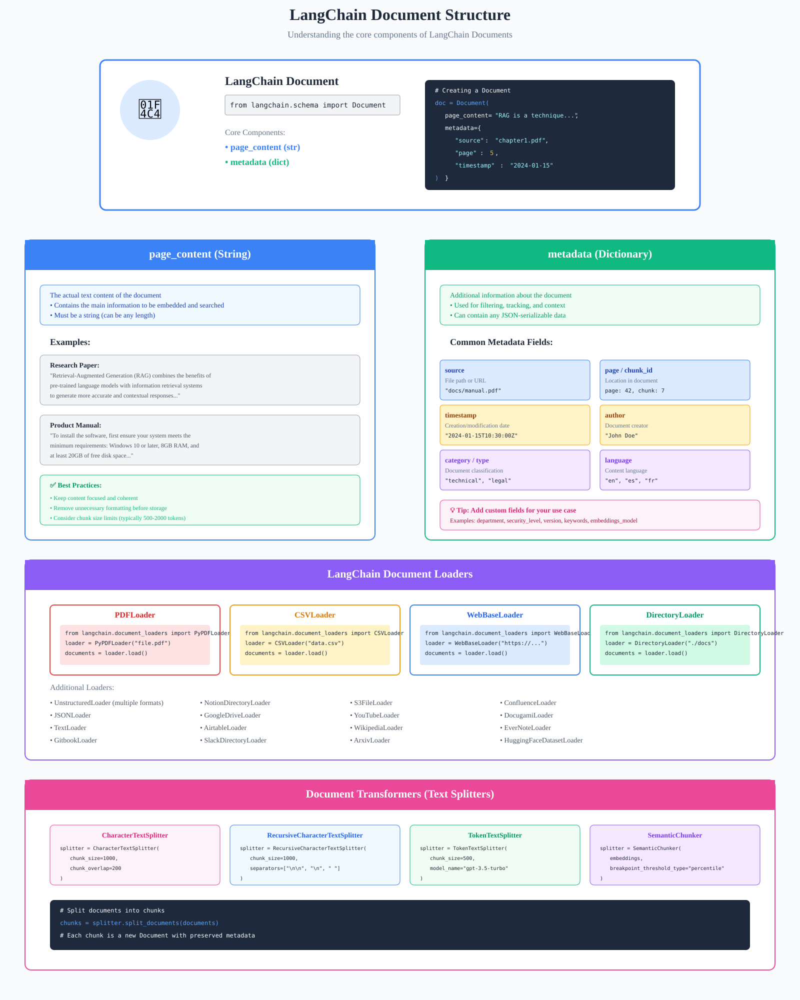

# Document Ingestion, Parsing, and Extraction Architecture in RAG

Welcome to the **Document Ingestion & Parsing** module (`0-DataIngestParsing`). This directory contains production-grade implementations, extraction strategies, and performance benchmarks for ingesting heterogeneous enterprise data sources into LangChain `Document` primitives for downstream chunking, embedding, and vector retrieval.

---

## 📑 Table of Contents
1. [Module Roadmap & Notebook Sitemap](#-module-roadmap--notebook-sitemap)
2. [Core Ingestion Concepts & LangChain Primitives](#-core-ingestion-concepts--langchain-primitives)
   - [The LangChain Document Primitive](#the-langchain-document-primitive)
   - [Lazy Loading (`lazy_load`) vs Eager Loading (`load`)](#lazy-loading-lazy_load-vs-eager-loading-load)
   - [Multithreaded Directory Scanning & Concurrency](#multithreaded-directory-scanning--concurrency)
3. [Format-Specific Ingestion & Parsing Deep Dives](#-format-specific-ingestion--parsing-deep-dives)
   - [1. Plain Text Files (.txt)](#1-plain-text-files-txt)
   - [2. Portable Document Format (PDF)](#2-portable-document-format-pdf)
   - [3. Microsoft Word Documents (.docx / .doc)](#3-microsoft-word-documents-docx--doc)
   - [4. Tabular Data (CSV & Excel)](#4-tabular-data-csv--excel)
   - [5. Hierarchical Data (JSON & JSON Lines)](#5-hierarchical-data-json--json-lines)
   - [6. Relational SQL Databases](#6-relational-sql-databases)
4. [Comprehensive Document Loader Comparison Matrix](#-comprehensive-document-loader-comparison-matrix)
5. [Visual Architecture Diagrams](#-visual-architecture-diagrams)
6. [End-to-End Production Code Snippets](#-end-to-end-production-code-snippets)
7. [Decision Framework: Which Loader Should You Choose?](#-decision-framework-which-loader-should-you-choose)
8. [Production Best Practices & Failure Modes](#-production-best-practices--failure-modes)

---

## 🗺️ Module Roadmap & Notebook Sitemap

| Notebook | File Types Covered | Primary Loaders & Libraries | Core Concepts Covered |
| :--- | :--- | :--- | :--- |
| [**1-dataingestion.ipynb**](file:///c:/RAG/Code/0-DataIngestParsing/1-dataingestion.ipynb) | `.txt`, Directories | `TextLoader`, `DirectoryLoader` | Core LangChain `Document` schema (`page_content`, `metadata`), directory traversal, glob filtering, silent error handling (`silent_errors=True`), and character-level text splitting foundations. |
| [**2-dataparsingpdf.ipynb**](file:///c:/RAG/Code/0-DataIngestParsing/2-dataparsingpdf.ipynb) | `.pdf` | `PyPDFLoader`, `PyMuPDFLoader` (fitz), `PDFPlumberLoader`, `UnstructuredPDFLoader` | High-speed PDF text extraction, page-by-page chunking, complex tabular retention, OCR on scanned pages, multi-column reading orders, encrypted PDF bypass, and loader speed/accuracy benchmarks. |
| [**3-dataparsingdoc.ipynb**](file:///c:/RAG/Code/0-DataIngestParsing/3-dataparsingdoc.ipynb) | `.docx`, `.doc` | `Docx2txtLoader`, `UnstructuredWordDocumentLoader` | Word document ingestion, lightweight plain text extraction vs semantic layout tagging (titles, narrative text, bulleted lists, header hierarchies), and XML extraction mechanics. |
| [**4-csvexcelparsing.ipynb**](file:///c:/RAG/Code/0-DataIngestParsing/4-csvexcelparsing.ipynb) | `.csv`, `.xlsx`, `.xls` | `CSVLoader`, `UnstructuredExcelLoader`, `openpyxl`, `pandas` | Tabular data representation in LLMs, row-to-document transformation, column name prefixing, multi-sheet workbook parsing, preserving cell formulas vs evaluated values, and dataframe streaming. |
| [**5-jsonparsing.ipynb**](file:///c:/RAG/Code/0-DataIngestParsing/5-jsonparsing.ipynb) | `.json`, `.jsonl` | `JSONLoader`, `jq` syntax | Parsing hierarchical and nested schemas, jq query filters (`jq_schema`), schema field extraction, JSON Lines stream processing, and custom metadata extraction functions. |
| [**6-databaseparsing.ipynb**](file:///c:/RAG/Code/0-DataIngestParsing/6-databaseparsing.ipynb) | SQL Databases (SQLite, PostgreSQL, MySQL) | `SQLDatabaseLoader`, SQLAlchemy | Relational table extraction, executing raw SQL SELECT queries, converting relational tuples into document text, and mapping database primary keys/foreign keys to document metadata. |

---

## 🔍 Core Ingestion Concepts & LangChain Primitives

Document ingestion is the foundation of every Retrieval-Augmented Generation system. Ingestion errors directly corrupt downstream chunks, ruin embedding representations, and produce hallucinations:
$$\text{"Garbage in, Garbage out" in RAG: If ingestion misses tables or corrupts formatting, the retriever cannot find it.}$$

### The LangChain Document Primitive
Every document loader in LangChain normalizes arbitrary raw files into a standardized `Document` object:

```python
class Document:
    page_content: str       # Raw textual information extracted from the source
    metadata: dict          # Structured contextual metadata (source, page, author, row, timestamp)
```

#### Why Metadata Matters:
1. **Provenance & Source Attribution**: Downstream conversational chains cite exact page numbers and document paths.
2. **Metadata Filtering in Vector Databases**: Vector databases (Chroma, Pinecone, FAISS) use metadata dictionaries to run single-stage filters (e.g., `WHERE author = 'Arpit' AND year = 2026`).
3. **Chunk Deduplication**: Hashing `(metadata['source'], metadata['page'])` avoids redundant vector storage.

---

### Lazy Loading (`lazy_load`) vs Eager Loading (`load`)

| Method | Execution Pattern | Memory Footprint ($RAM$) | Best Used When |
| :--- | :--- | :--- | :--- |
| **`loader.load()`** | Eager: Loads all documents into memory as a Python `list[Document]`. | High: $O(N)$ memory proportional to corpus size. | Small datasets, unit tests, quick prototyping (< 100 MB). |
| **`loader.lazy_load()`** | Lazy: Returns a Python generator yielding one `Document` at a time. | Low: $O(1)$ memory; only current document resides in RAM. | Large archives, streaming pipelines, multi-gigabyte corpora. |

```python
# Production memory-safe pattern using lazy loading
for doc in loader.lazy_load():
    chunks = text_splitter.split_documents([doc])
    vectorstore.add_documents(chunks)
```

---

### Multithreaded Directory Scanning & Concurrency

When scanning directories containing thousands of files, sequential I/O creates bottlenecks. `DirectoryLoader` provides native multithreading:

```python
from langchain_community.document_loaders import DirectoryLoader, TextLoader

loader = DirectoryLoader(
    path="../data/text_files",
    glob="**/*.txt",
    loader_cls=TextLoader,
    loader_kwargs={"encoding": "utf-8"},
    show_progress=True,
    use_multithreading=True,
    max_concurrency=8
)
```

---

## 📂 Format-Specific Ingestion & Parsing Deep Dives

### 1. Plain Text Files (.txt)
* **Mechanics**: Reads unformatted text streams directly into memory.
* **Key Challenge**: Character encoding mismatches (UTF-8, ASCII, CP1252, Latin-1).
* **Solution**: Explicitly set `loader_kwargs={"encoding": "utf-8"}`. For mixed-encoding directories, specify `autodetect_encoding=True`.

---

### 2. Portable Document Format (PDF)
PDF was designed for high-fidelity visual rendering and printing—not machine readability. Internal PDF streams consist of low-level drawing commands (`BT ... ET`) with floating-point coordinate offsets rather than structured paragraphs.

* **`PyPDFLoader`**: Pure Python, zero native dependencies, extracts text page-by-page. Ideal for lightweight, standard single-column text documents.
* **`PyMuPDFLoader` (fitz)**: C-based parser, **5x to 10x faster** than PyPDF. Exceptional handling of page coordinate spaces and complex typography.
* **`PDFPlumberLoader`**: Specialized in tabular extraction. Preserves cell boundaries and spatial alignment for financial tables and spreadsheets.
* **`UnstructuredPDFLoader`**: Leverages layout analysis and optional Tesseract OCR to distinguish headers, footers, narrative blocks, and scanned raster pages.

---

### 3. Microsoft Word Documents (.docx / .doc)
* **`Docx2txtLoader`**: Unzips the underlying OpenXML package and extracts raw text from `word/document.xml`. Extremely fast, low overhead, strips all formatting.
* **`UnstructuredWordDocumentLoader`**: Parses heading hierarchies (`Heading 1`, `Heading 2`), unordered lists, tables, and document properties into structured element blocks.

---

### 4. Tabular Data (CSV & Excel)
* **`CSVLoader`**: Transforms each table row into an individual `Document`. Column headers become key-value prefixes:
  ```
  EmployeeID: 104
  Name: Jane Doe
  Department: Engineering
  Salary: 145000
  ```
* **`UnstructuredExcelLoader` / `openpyxl`**: Iterates across multiple worksheets, extracting tabular grids into either textual markdown representations or row-level chunk schemas.

---

### 5. Hierarchical Data (JSON & JSON Lines)
* **`JSONLoader`**: Uses `jq` query strings (`jq_schema`) to select target arrays or fields, discarding envelope wrappers:
  ```python
  # Target only the 'content' field within a nested 'records' array
  loader = JSONLoader(
      file_path="data.json",
      jq_schema=".records[].content",
      text_content=False
  )
  ```
* **JSONL (JSON Lines)**: Supports streaming large line-delimited records without parsing the entire file into memory simultaneously (`json_lines=True`).

---

### 6. Relational SQL Databases
* **`SQLDatabaseLoader`**: Queries relational databases using SQLAlchemy engines.
* **Field Mapping**: Formulates `SELECT` statements, stores chosen column combinations inside `page_content`, and populates relational IDs into `metadata`.

---

## 📊 Comprehensive Document Loader Comparison Matrix

| Loader | Target Formats | Speed / Throughput | Table Preservation | OCR Capability | Memory Efficiency | Best Use Case |
| :--- | :--- | :--- | :--- | :--- | :--- | :--- |
| **`TextLoader`** | `.txt`, `.md` | Ultra Fast ($> 100\text{ MB/s}$) | N/A (Plain Text) | No | Extremely High | Plain text logs, markdown documentation, code files |
| **`DirectoryLoader`** | Multi-file directories | Configurable via threads | Inherits child loader | Inherits child loader | High (`lazy_load`) | Bulk filesystem scanning, ingestion ingestion pools |
| **`PyPDFLoader`** | `.pdf` | Moderate ($\approx 20\text{ pages/s}$) | Low (Strips borders) | No | High | Simple text-only PDFs, standard whitepapers |
| **`PyMuPDFLoader`** | `.pdf` | Ultra Fast ($\approx 150\text{ pages/s}$) | Moderate | No | High | High-throughput batch PDF processing |
| **`PDFPlumberLoader`** | `.pdf` | Moderate ($\approx 10\text{ pages/s}$) | **High** (Extracts table grids) | No | Moderate | Invoices, financial statements, balance sheets |
| **`UnstructuredPDFLoader`** | `.pdf`, scanned docs | Slower ($\approx 2 - 5\text{ pages/s}$) | **Very High** | **Yes** (Tesseract) | Moderate | Scanned documents, complex magazine/academic layouts |
| **`Docx2txtLoader`** | `.docx` | Very Fast | Low | No | High | Plain Microsoft Word document text extraction |
| **`UnstructuredWordLoader`**| `.docx`, `.doc` | Moderate | Moderate | No | Moderate | Word documents with nested headings and section hierarchies |
| **`CSVLoader`** | `.csv` | High | High (Row-level key-value) | No | High | Tabular datasets, catalogs, structured records |
| **`UnstructuredExcelLoader`**| `.xlsx`, `.xls` | Moderate | High (Sheet grids) | No | Moderate | Complex multi-tab financial models and spreadsheets |
| **`JSONLoader`** | `.json`, `.jsonl` | High (powered by `jq`) | High (Preserves hierarchy) | No | High | API payloads, MongoDB dumps, chat log exports |
| **`SQLDatabaseLoader`** | SQLite, PostgreSQL, MySQL | Database-bound | Native relational | No | Streaming | Relational tables, CRM records, enterprise databases |

---

## 🖼️ Visual Architecture Diagrams

### 1. Document Ingestion in the RAG Lifecycle
The diagram below illustrates the path from raw, unparsed enterprise documents through parsing and splitting into vectorized storage:

<div align="center">
  
</div>

---

### 2. LangChain Document Components & Metadata Flow
The diagram below details how file loaders transform raw unstructured files into normalized `Document(page_content, metadata)` objects:

<div align="center">
  
</div>

---

## 💻 End-to-End Production Code Snippets

### 1. Text & Directory Ingestion (Multithreaded & Resilient)
```python
from langchain_community.document_loaders import DirectoryLoader, TextLoader

# Ingest all text files with UTF-8 encoding and multithreading
dir_loader = DirectoryLoader(
    path="../data/text_files",
    glob="*.txt",
    loader_cls=TextLoader,
    loader_kwargs={"encoding": "utf-8"},
    silent_errors=True,
    use_multithreading=True,
    max_concurrency=4
)

documents = dir_loader.load()
print(f"Loaded {len(documents)} text documents.")
```

---

### 2. High-Performance PDF Ingestion (PyMuPDF)
```python
from langchain_community.document_loaders import PyMuPDFLoader

pdf_loader = PyMuPDFLoader(
    file_path="../data/pdf/machine_learning.pdf",
    extract_images=False
)

pdf_docs = pdf_loader.load()
print(f"Parsed {len(pdf_docs)} pages. Page 1 metadata: {pdf_docs[0].metadata}")
```

---

### 3. Word Document Extraction (.docx)
```python
from langchain_community.document_loaders import Docx2txtLoader

doc_loader = Docx2txtLoader(file_path="../data/word_files/sample.docx")
doc_content = doc_loader.load()
print(f"Extracted {len(doc_content[0].page_content)} characters from Word document.")
```

---

### 4. Tabular CSV Ingestion (Row-Based Schema)
```python
from langchain_community.document_loaders import CSVLoader

csv_loader = CSVLoader(
    file_path="../data/structured_files/employees.csv",
    source_column="EmployeeID",
    encoding="utf-8"
)

csv_docs = csv_loader.load()
print(f"Converted {len(csv_docs)} rows into LangChain documents.")
```

---

### 5. Hierarchical JSON Extraction with `jq` Schema
```python
from langchain_community.document_loaders import JSONLoader

# Extract all elements inside an array named 'data'
json_loader = JSONLoader(
    file_path="../data/json_files/api_response.json",
    jq_schema=".data[].summary",
    text_content=True
)

json_docs = json_loader.load()
print(f"Extracted {len(json_docs)} JSON records.")
```

---

### 6. Relational SQL Database Extraction
```python
from langchain_community.document_loaders import SQLDatabaseLoader
from sqlalchemy import create_engine

engine = create_engine("sqlite:///../data/databases/ecommerce.db")

sql_loader = SQLDatabaseLoader(
    query="SELECT product_id, product_name, description, price FROM products WHERE stock > 0",
    engine=engine,
    page_content_columns=["product_name", "description"],
    metadata_columns=["product_id", "price"]
)

db_docs = sql_loader.load()
print(f"Extracted {len(db_docs)} records from SQL database.")
```

---

## 🎯 Decision Framework: Which Loader Should You Choose?

1. **For PDF Documents**:
   - Need maximum speed? Use **`PyMuPDFLoader`**.
   - Contains balance sheets, tables, or financial forms? Use **`PDFPlumberLoader`**.
   - Scanned image or photocopy? Use **`UnstructuredPDFLoader`** with OCR enabled.
   - Standard text-only single column? Use **`PyPDFLoader`**.
2. **For Microsoft Word**:
   - Fast, basic text extraction? Use **`Docx2txtLoader`**.
   - Need heading levels, lists, and layout element tagging? Use **`UnstructuredWordDocumentLoader`**.
3. **For Structured & Semi-Structured Data**:
   - Flat rows and columns? Use **`CSVLoader`**.
   - Nested objects, APIs, or event streams? Use **`JSONLoader`** with `jq`.
   - Live enterprise transactional data? Use **`SQLDatabaseLoader`**.

---

## ⚠️ Production Best Practices & Failure Modes

1. **Explicit Encoding Declaration**: Always pass `encoding="utf-8"` to file loaders. On Windows, default file opens use CP1252 or Latin-1, causing silent character corruption (`\ufffd`).
2. **Preventing Out-of-Memory (OOM) Errors**: Never call `.load()` on directories with tens of thousands of files or multi-gigabyte PDFs. Always stream using `.lazy_load()`.
3. **Sanitizing Downstream Metadata**: Downstream vector stores (Chroma, Pinecone) reject complex nested dictionaries or lists in `doc.metadata`. Flatten all metadata to primitive types (`str`, `int`, `float`, `bool`) during ingestion:
   ```python
   def sanitize_metadata(doc: Document) -> Document:
       clean_meta = {}
       for k, v in doc.metadata.items():
           if isinstance(v, (str, int, float, bool)):
               clean_meta[k] = v
           else:
               clean_meta[k] = str(v)
       doc.metadata = clean_meta
       return doc
   ```
4. **Header/Footer Stripping**: Running headers and page footers (e.g., *"Page 12 of 85 - Confidential"*) pollute retrieval results. Strip repetitive page margins prior to chunking.
