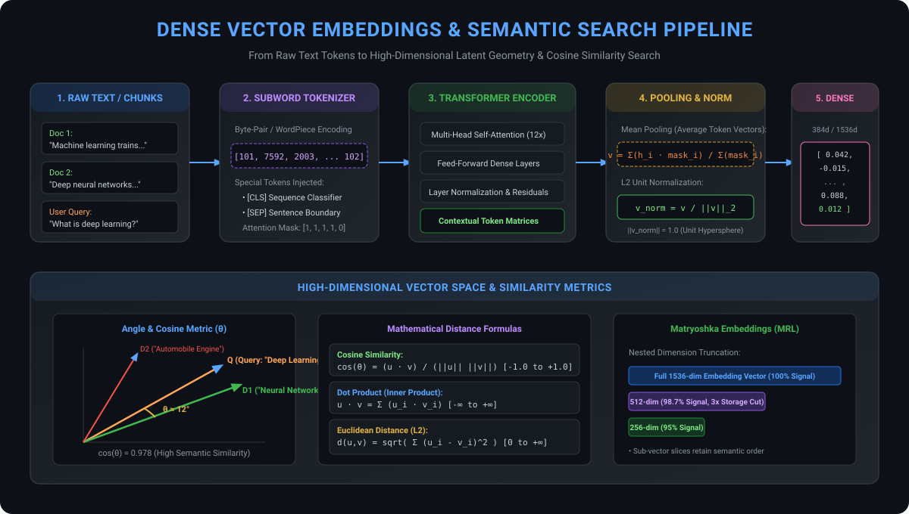

# Vector Embeddings & Semantic Representation Architecture in RAG

Welcome to the **Vector Embeddings** module (`1-Embiddings`). This directory contains comprehensive implementations, mathematical foundations, and production benchmarks for transforming unstructured text into high-dimensional geometric representations that empower dense semantic search, similarity ranking, and retrieval pipelines in modern RAG systems.

---

## 📑 Table of Contents
1. [Module Roadmap & Notebook Sitemap](#-module-roadmap--notebook-sitemap)
2. [What Are Vector Embeddings? (Internal Mechanics)](#-what-are-vector-embeddings-internal-mechanics)
   - [From Tokens to Continuous Latent Geometry](#from-tokens-to-continuous-latent-geometry)
   - [Transformer Encoder Pipeline: Tokenization to L2 Normalization](#transformer-encoder-pipeline-tokenization-to-l2-normalization)
   - [Dense vs Sparse vs Hybrid Embeddings](#dense-vs-sparse-vs-hybrid-embeddings)
3. [Mathematical Foundations & Similarity Metrics](#-mathematical-foundations--similarity-metrics)
   - [Cosine Similarity](#1-cosine-similarity)
   - [Dot Product (Inner Product)](#2-dot-product-inner-product)
   - [Euclidean Distance (L2)](#3-euclidean-distance-l2)
   - [The Equivalence Theorem for Normalized Vectors](#the-equivalence-theorem-for-normalized-vectors)
4. [Matryoshka Representation Learning (MRL)](#-matryoshka-representation-learning-mrl)
5. [Comprehensive Embedding Model Comparison Matrix](#-comprehensive-embedding-model-comparison-matrix)
6. [Visual Architecture Diagrams](#-visual-architecture-diagrams)
7. [End-to-End Production Code Snippets](#-end-to-end-production-code-snippets)
8. [Decision Framework: Which Embedding Model Should You Choose?](#-decision-framework-which-embedding-model-should-you-choose)
9. [Production Best Practices & Common Pitfalls](#-production-best-practices--common-pitfalls)

---

## 🗺️ Module Roadmap & Notebook Sitemap

| Notebook | Focus & Providers | Primary Libraries | Core Concepts Covered |
| :--- | :--- | :--- | :--- |
| [**embedding.ipynb**](file:///c:/RAG/Code/1-Embiddings/embedding.ipynb) | Open-Source Foundations, HuggingFace | `langchain_huggingface`, `sentence-transformers`, `numpy`, `matplotlib` | Geometric intuition of embeddings, 2D vector space projections, cosine similarity math from scratch, loading local open-source transformer models (`all-MiniLM-L6-v2`), asymmetric semantic search, batch document encoding, and latency benchmarking. |
| [**openaiembeddings.ipynb**](file:///c:/RAG/Code/1-Embiddings/openaiembeddings.ipynb) | Cloud Serverless, OpenAI | `langchain_openai`, `openai`, `dotenv`, `numpy` | Production cloud embedding models (`text-embedding-3-small`, `text-embedding-3-large`, `text-embedding-ada-002`), `embed_query` vs `embed_documents`, Matryoshka Representation Learning (MRL) dimension reduction (`dimensions=512`), pairwise similarity heatmaps, and ranking query candidates. |

---

## 🔍 What Are Vector Embeddings? (Internal Mechanics)

### From Tokens to Continuous Latent Geometry
Computers and deep neural networks cannot directly process raw natural language strings. **Embeddings** project words, sentences, or paragraphs into an $N$-dimensional continuous vector space:
$$\vec{v} \in \mathbb{R}^d \quad (d \in [384, 3072])$$

In this latent space, **spatial proximity equals semantic similarity**. Concepts that share contextual meaning (e.g., *"cat"* and *"kitten"*) are placed in close geometric proximity, while unrelated concepts (e.g., *"cat"* and *"automobile"*) are separated by wide angular distances.

---

### Transformer Encoder Pipeline: Tokenization to L2 Normalization
When text passes through an embedding model (like `all-MiniLM-L6-v2` or `text-embedding-3-small`), it undergoes five rigorous stages:

1. **Subword Tokenization**: Text is split into subword units (Byte-Pair Encoding or WordPiece) and wrapped with special boundary tokens (`[CLS]` at the start, `[SEP]` at the end).
2. **Contextual Token Embeddings**: Multi-head self-attention layers compute contextualized hidden states for every token based on its surrounding syntax and semantics.
3. **Pooling (Reduction)**:
   - **Mean Pooling**: Calculates the arithmetic mean of all token hidden states, weighted by the attention mask:
     $$\vec{v} = \frac{\sum_{i=1}^L h_i \cdot \text{mask}_i}{\sum_{i=1}^L \text{mask}_i}$$
   - **CLS Pooling**: Selects the first token hidden state ($h_0$) directly as the sentence representation.
4. **$L_2$ Unit Normalization**: Divides the vector by its Euclidean length so that its magnitude is exactly $1.0$:
   $$\vec{v}_{\text{norm}} = \frac{\vec{v}}{\|\vec{v}\|_2}$$
   All normalized vectors lie on the surface of an $N$-dimensional **unit hypersphere**.

---

### Dense vs Sparse vs Hybrid Embeddings

| Feature | Dense Embeddings (HuggingFace / OpenAI) | Sparse Embeddings (BM25 / SPLADE) | Hybrid (Dense + Sparse) |
| :--- | :--- | :--- | :--- |
| **Vector Space** | Compact, continuous float32 (384 to 3072 dimensions) | High-dimensional, sparse (vocab size $\approx 30,000+$) | Linear combination of both |
| **Search Mechanism**| Cosine / Dot Product over dense float arrays | Inverted indices (term frequency / posting lists) | Reciprocal Rank Fusion (RRF) |
| **Strengths** | Understands synonyms, context, paraphrase, and intent | Exact keyword match, serial numbers, acronyms, code | Best-of-both-worlds precision & recall |
| **Weaknesses** | Can miss exact technical IDs or uncommon proper nouns | Fails on conceptual paraphrasing or synonyms | Higher compute and storage footprint |

---

## 📐 Mathematical Foundations & Similarity Metrics

### 1. Cosine Similarity
Measures the cosine of the angle $\theta$ between two non-zero vectors $u$ and $v$:
$$\text{Cosine Similarity}(u, v) = \cos(\theta) = \frac{u \cdot v}{\|u\|_2 \|v\|_2} = \frac{\sum_{i=1}^d u_i v_i}{\sqrt{\sum_{i=1}^d u_i^2} \cdot \sqrt{\sum_{i=1}^d v_i^2}}$$

* **Range**: $[-1.0, +1.0]$
* **Interpretation**:
  * $+1.0 \implies$ Identical semantic direction ($\theta = 0^\circ$).
  * $0.0 \implies$ Orthogonal vectors; completely unrelated concepts ($\theta = 90^\circ$).
  * $-1.0 \implies$ Diametrically opposed semantic direction ($\theta = 180^\circ$).
* **Advantage**: Purely angular metric; completely invariant to document length or vector magnitude.

---

### 2. Dot Product (Inner Product)
$$\text{Dot Product}(u, v) = u \cdot v = \sum_{i=1}^d u_i v_i$$

* **Range**: $(-\infty, +\infty)$
* **Interpretation**: Higher values mean greater alignment.
* **Advantage**: Fastest distance metric on modern CPUs and GPUs; requires only fused multiply-add (FMA) instructions without square roots or divisions.

---

### 3. Euclidean Distance ($L_2$)
Measures the straight-line geometric distance between two points in $d$-dimensional Euclidean space:
$$d(u, v) = \|u - v\|_2 = \sqrt{\sum_{i=1}^d (u_i - v_i)^2}$$

* **Range**: $[0, \infty)$
* **Interpretation**: **Lower is closer/more similar**. $0$ indicates identical points.

---

### The Equivalence Theorem for Normalized Vectors
When vectors $u$ and $v$ are **$L_2$-normalized** such that $\|u\|_2 = \|v\|_2 = 1.0$:

$$\|u - v\|_2^2 = (u - v) \cdot (u - v) = \|u\|^2 + \|v\|^2 - 2(u \cdot v) = 1 + 1 - 2(u \cdot v) = 2 - 2(u \cdot v)$$

$$\boxed{\|u - v\|_2 = \sqrt{2 - 2(u \cdot v)} = \sqrt{2 - 2\cos(\theta)}}$$

> [!TIP]
> **Production Takeaway**: When your embeddings are normalized, **Cosine Similarity and Dot Product produce the exact same ranking order as Euclidean Distance**. Always configure your vector index (Chroma, FAISS, Pinecone) to use **Cosine** or **Dot Product** to maximize search throughput.

---

## 🪆 Matryoshka Representation Learning (MRL)

OpenAI's third-generation embedding models (`text-embedding-3-small` and `text-embedding-3-large`) were trained using **Matryoshka Representation Learning (MRL)**.

```
Full Vector (1536 dims):  [ v1, v2, v3, ..., v256, ..., v512, ..., v1536 ]  (100% fidelity)
Truncated (512 dims):     [ v1, v2, v3, ..., v256, ..., v512 ]              (98.7% fidelity, 3x storage savings)
Truncated (256 dims):     [ v1, v2, v3, ..., v256 ]                         (95.0% fidelity, 6x storage savings)
```

In standard embeddings, truncating dimensions destroys semantic signal. In MRL, the model is trained with multiple nested loss functions simultaneously, forcing the earliest dimensions to capture the most critical semantic variance.

### Benefits in Production:
1. **$3\times$ Lower Vector Database RAM & Disk Cost**: 512 dimensions use only 2 KB per chunk compared to 6 KB for 1536 dimensions.
2. **$3\times$ Faster Index Traversal**: HNSW distance calculations scale linearly with dimension count ($O(d)$).
3. **Negligible Quality Drop**: Benchmark tests show less than a 1.5% drop in MTEB retrieval recall when truncating from 1536 to 512 dimensions.

---

## 📊 Comprehensive Embedding Model Comparison Matrix

| Model Name | Provider | Vector Dimensions | Max Tokens (Context) | MTEB Retrieval Score | Hosting / Privacy | Pricing / Cost | Primary Production Use Case |
| :--- | :--- | :--- | :--- | :--- | :--- | :--- | :--- |
| **`all-MiniLM-L6-v2`** | HuggingFace | **384** | 256 | 56.3 | Local / Self-Hosted | **Free (Open Source)** | High-throughput local RAG, edge devices, zero API cost |
| **`bge-small-en-v1.5`** | BAAI (HuggingFace) | **384** | 512 | 62.1 | Local / Self-Hosted | **Free (Open Source)** | Best-in-class small open-source model for production RAG |
| **`bge-large-en-v1.5`** | BAAI (HuggingFace) | **1024** | 512 | 64.2 | Local / Self-Hosted | **Free (Open Source)** | High-accuracy local semantic search with GPU acceleration |
| **`text-embedding-3-small`**| OpenAI | **1536** (or **512**) | **8,191** | 62.3 | Cloud API | \$0.02 / 1M tokens | General enterprise RAG, balanced cost/accuracy |
| **`text-embedding-3-large`**| OpenAI | **3072** (or **1024**) | **8,191** | **64.6** | Cloud API | \$0.13 / 1M tokens | High-precision legal, financial, and academic RAG |
| **`text-embedding-ada-002`**| OpenAI (Legacy) | **1536** | 8,191 | 61.0 | Cloud API | \$0.10 / 1M tokens | Legacy pipelines (deprecated in favor of `3-small`) |
| **`nomic-embed-text-v1.5`** | Nomic AI | **768** (MRL ready) | **8,192** | 62.4 | Local / Cloud API | Free / \$0.02 / 1M | Long-context documents requiring open weights |

---

## 🖼️ Visual Architecture Diagrams

The diagram below details the end-to-end vector embedding generation lifecycle, from raw text subwords through self-attention, pooling, L2 hypersphere normalization, and high-dimensional cosine similarity ranking:

<div align="center">
  
</div>

---

## 💻 End-to-End Production Code Snippets

### 1. Open-Source HuggingFace Embeddings (Local & Fast)
```python
from langchain_huggingface import HuggingFaceEmbeddings

# Initialize local HuggingFace embedding model
embeddings_hf = HuggingFaceEmbeddings(
    model_name="sentence-transformers/all-MiniLM-L6-v2",
    model_kwargs={"device": "cpu"},          # or 'cuda' for GPU acceleration
    encode_kwargs={"normalize_embeddings": True} # Automatically L2-normalize
)

# 1. Embed single user query
query_vector = embeddings_hf.embed_query("What is deep learning?")
print(f"Query vector dimensions: {len(query_vector)}")  # 384

# 2. Batch embed documents
docs = [
    "Machine learning learns patterns from training data.",
    "Deep neural networks have revolutionized computer vision."
]
doc_vectors = embeddings_hf.embed_documents(docs)
print(f"Generated {len(doc_vectors)} embeddings of shape {len(doc_vectors[0])}.")
```

---

### 2. OpenAI Cloud Embeddings with Matryoshka Dimension Reduction
```python
import os
from dotenv import load_dotenv
from langchain_openai import OpenAIEmbeddings

load_dotenv("../.env")

# Initialize OpenAI embeddings with Matryoshka 512-dimension reduction
embeddings_openai = OpenAIEmbeddings(
    model="text-embedding-3-small",
    dimensions=512,  # Compress from 1536 to 512 (saves 3x vector DB storage)
    api_key=os.getenv("OPENAI_API_KEY")
)

vector_512 = embeddings_openai.embed_query("Explain vector embeddings.")
print(f"MRL compressed vector dimensions: {len(vector_512)}")  # 512
```

---

### 3. Pure NumPy Vector Math & Cosine Similarity from Scratch
```python
import numpy as np

def cosine_similarity(u: list[float], v: list[float]) -> float:
    """Computes exact cosine similarity between two vector lists."""
    vec_u = np.array(u, dtype=np.float32)
    vec_v = np.array(v, dtype=np.float32)
    return float(np.dot(vec_u, vec_v) / (np.linalg.norm(vec_u) * np.linalg.norm(vec_v)))

def compute_similarity_matrix(vectors: list[list[float]]) -> np.ndarray:
    """Computes pairwise cosine similarity matrix across an entire document set."""
    matrix = np.array(vectors, dtype=np.float32)
    norm = np.linalg.norm(matrix, axis=1, keepdims=True)
    normalized = matrix / np.maximum(norm, 1e-12)
    return np.dot(normalized, normalized.T)
```

---

### 4. Minimal Semantic Search Engine Built in NumPy
```python
import numpy as np

corpus = [
    "Convolutional Neural Networks are designed for computer vision and image processing.",
    "Recurrent Neural Networks and Transformers excel at sequential natural language processing.",
    "Supervised learning trains models on labeled input-output pairs.",
    "Reinforcement learning optimizes decision-making using environmental reward signals."
]

# Generate normalized corpus vectors
corpus_vectors = np.array(embeddings_hf.embed_documents(corpus))

def semantic_search(query: str, top_k: int = 2):
    query_vector = np.array(embeddings_hf.embed_query(query))
    
    # Compute dot products (equivalent to cosine similarity for normalized vectors)
    scores = np.dot(corpus_vectors, query_vector)
    
    # Sort top-k indices in descending order
    top_indices = np.argsort(scores)[::-1][:top_k]
    
    print(f"\nQuery: '{query}'")
    for rank, idx in enumerate(top_indices, 1):
        print(f"  Rank {rank} (Score: {scores[idx]:.4f}): {corpus[idx]}")

semantic_search("How do models process human text?")
```

---

## 🎯 Decision Framework: Which Embedding Model Should You Choose?

1. **Prioritizing Zero Cost, Local Privacy, or Offline Execution?**
   - Choose **`sentence-transformers/all-MiniLM-L6-v2`** for maximum speed on CPU.
   - Choose **`BAAI/bge-small-en-v1.5`** for the highest retrieval accuracy in a lightweight model.
2. **Building a Scalable Enterprise Cloud Application?**
   - Choose **`text-embedding-3-small`** with `dimensions=512`. It delivers cloud reliability, 8,191-token context, and $3\times$ storage savings.
3. **Mission-Critical Legal, Medical, or Scientific Precision?**
   - Choose **`text-embedding-3-large`** or **`BAAI/bge-large-en-v1.5`**.
4. **Processing Very Long Documents (> 1,000 words per chunk)?**
   - Choose **`text-embedding-3-small`** or **`nomic-embed-text-v1.5`** (8k token context windows).

---

## ⚠️ Production Best Practices & Common Pitfalls

1. **Never Mix Embedding Models in the Same Index**: A vector space is unique to the exact model weights that generated it. Vectors from `all-MiniLM-L6-v2` cannot be queried with `text-embedding-3-small`. If you upgrade models, you must re-embed your entire document collection.
2. **Context Length Truncation**: Models have hard sequence limits (`all-MiniLM-L6-v2` has 256 tokens; `bge-small` has 512 tokens). Text exceeding this limit is silently truncated by the tokenizer, completely discarding the end of the text. Always chunk text within the model's safe token window.
3. **Always Normalize Vectors**: Ensure `normalize_embeddings=True` is enabled. Normalization guarantees that dot product matches cosine similarity, vastly accelerating vector database search queries.
4. **Use Asymmetric Prefixes When Required**: Certain models (e.g., BGE, E5) require distinct prefixes to distinguish questions from passages:
   - Query: `"Represent this sentence for searching relevant passages: {query}"`
   - Document: `"{passage}"`
   Using `langchain_huggingface` automatically handles model-specific prefixing when available.
