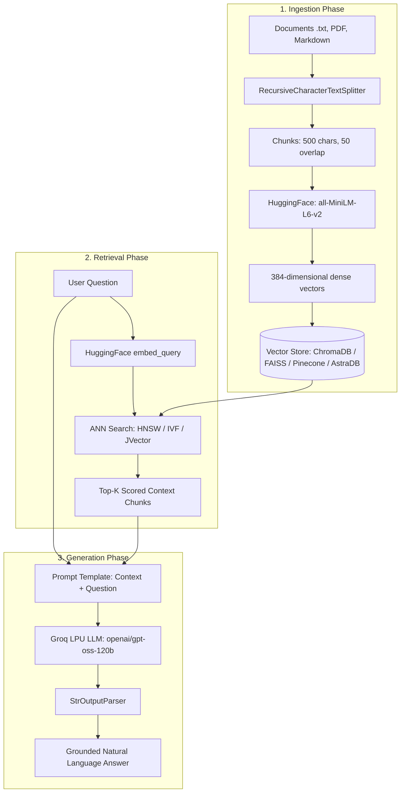

# Vector Databases & Dense Retrieval Architecture in RAG

Welcome to the **Vector Stores & Embeddings** module (`2-Vectorstores`). This directory contains comprehensive, enterprise-grade implementations, architectural deep dives, and production RAG pipelines across modern vector databases.

---

## 📑 Table of Contents
1. [Module Roadmap & Notebook Sitemap](#-module-roadmap--notebook-sitemap)
2. [What Vector Databases Use Inside for Searching (Internal Mechanics)](#-what-vector-databases-use-inside-for-searching-internal-mechanics)
   - [1. HNSW (Hierarchical Navigable Small World)](#1-hnsw-hierarchical-navigable-small-world)
   - [2. IVF (Inverted File Index)](#2-ivf-inverted-file-index)
   - [3. PQ (Product Quantization) & IVFPQ](#3-pq-product-quantization--ivfpq)
   - [4. Storage-Attached Indexing (SAI) & JVector (DiskANN)](#4-storage-attached-indexing-sai--jvector-diskann)
   - [5. Proprietary Serverless Decoupled Indexing](#5-proprietary-serverless-decoupled-indexing)
   - [6. Flat Exact Search (Brute Force Matrix Multiplication)](#6-flat-exact-search-brute-force-matrix-multiplication)
   - [Distance Metrics Compared: L2 vs Cosine vs Dot Product](#distance-metrics-compared-l2-vs-cosine-vs-dot-product)
3. [Comprehensive Vector Database Comparison Matrix](#-comprehensive-vector-database-comparison-matrix)
4. [Visual Search Algorithm Architectures](#-visual-search-algorithm-architectures)
5. [End-to-End RAG Code Snippets (HuggingFace + Groq)](#-end-to-end-rag-code-snippets-huggingface--groq)
6. [Decision Framework: Which Vector DB Should You Choose?](#-decision-framework-which-vector-db-should-you-choose)

---

## 🗺️ Module Roadmap & Notebook Sitemap

| Notebook | Primary Technology | Hosting / Runtime Model | Core Concepts Covered |
| :--- | :--- | :--- | :--- |
| [**charomadb.ipynb**](file:///c:/RAG/Code/2-Vectorstores/charomadb.ipynb) | **ChromaDB** | Embedded / Local On-Disk (SQLite + HNSW) | Full RAG lifecycle, HNSW persistence, distance score metrics, LCEL pipelines, dynamic chunk ingestion, and 2-step Conversational RAG with query contextualization. |
| [**faisstest.ipynb**](file:///c:/RAG/Code/2-Vectorstores/faisstest.ipynb) | **Meta FAISS** | Embedded C++ Library (In-Memory / Local Index) | High-speed C++ vector indexing, cosine similarity benchmarking, metadata filtering, LCEL streaming chains, and conversational memory. |
| [**PineconeVectorDB.ipynb**](file:///c:/RAG/Code/2-Vectorstores/PineconeVectorDB.ipynb) | **Pinecone** | Cloud Serverless Managed Database | Decoupled compute/storage architecture, multi-tenant namespaces, single-stage metadata pre-filtering, score thresholding, and multi-turn chat memory. |
| [**Datastaxdb+(1).ipynb**](file:///c:/RAG/Code/2-Vectorstores/Datastaxdb+(1).ipynb) | **DataStax Astra DB** | Cloud Distributed Database (Apache Cassandra) | Masterless peer-to-peer Cassandra cluster, Storage-Attached Indexing (SAI), JVector on-disk graph search, MMR (Maximal Marginal Relevance), and hybrid CQL queries. |
| [**3-Othervectorstores.ipynb**](file:///c:/RAG/Code/2-Vectorstores/3-Othervectorstores.ipynb) | **InMemoryVectorStore** | Ephemeral RAM (Python Dictionary + NumPy) | Lightweight zero-dependency vector indexing, exact $O(N)$ cosine dot-product search, unit testing patterns, and ephemeral agent session memory. |

---

## 🔍 What Vector Databases Use Inside for Searching (Internal Mechanics)

Traditional relational databases use **B-Trees** to index ordered scalar data in $O(\log N)$ time. However, high-dimensional vector spaces (e.g., 384 to 3072 dimensions) suffer from the **Curse of Dimensionality**: in high dimensions, all points are almost equidistant from each other, rendering spatial partitioning trees like KD-Trees useless ($O(N)$ worst-case).

To achieve sub-millisecond retrieval across millions of vectors, vector databases employ **Approximate Nearest Neighbor (ANN)** algorithms that trade a microscopic percentage of recall accuracy ($< 1\%$) for orders-of-magnitude speedups.

Below is an in-depth breakdown of the exact internal algorithms used across vector databases:

---

### 1. HNSW (Hierarchical Navigable Small World)
* **Used by:** **ChromaDB**, **FAISS** (`IndexHNSWFlat`), **Weaviate**, **Qdrant**, **Milvus**.
* **Intuition:** Think of HNSW as an expressway highway system applied to high-dimensional geometry, or a multi-layered **Skip List** applied to graphs.

```
Layer 2 (Express):    [Node A] ──────────────────────────────────────────► [Node Z]
                         │                                                   │
Layer 1 (Regional):   [Node A] ─────────────► [Node M] ──────────────────► [Node Z]
                         │                       │                           │
Layer 0 (Local Graph):[Node A] ──► [Node B] ──► [Node M] ──► [Node Q] ──► [Node Z]
```

#### How HNSW Works:
1. **Multi-Layer Graph Hierarchy**:
   - Vectors are organized into multiple layers of geometric graphs.
   - The top layer has few nodes connected by long-distance links ("expressways").
   - Lower layers progressively contain more nodes with denser, shorter-range connections.
   - The bottom layer (`Layer 0`) contains every single vector in the collection.
2. **Search Traversal**:
   - The search begins at an entry point in the highest layer.
   - The algorithm greedily travels to the neighbor closest to the query vector.
   - When no neighbor is closer than the current node, the search drops down to the next layer at that same node.
   - At `Layer 0`, a beam search with width `efSearch` explores candidates to return the top-$k$ nearest vectors.
3. **Complexity & Performance**:
   - Search time complexity is **$O(\log N)$**, scaling smoothly to tens of millions of vectors.
   - **Key Hyperparameters**:
     - `M`: Maximum number of outgoing edges per node (typically 16–64). Higher $M$ = higher recall and larger index size.
     - `efConstruction`: Size of dynamic candidate list during index build time.
     - `efSearch`: Size of dynamic candidate list during query time. Higher $efSearch$ = higher recall at the expense of query latency.

---

### 2. IVF (Inverted File Index)
* **Used by:** **FAISS** (`IndexIVFFlat`), **Milvus**.
* **Intuition:** Instead of comparing against all $N$ vectors, partition the geometric space into clusters (Voronoi cells) and only inspect vectors inside the clusters closest to the query.

```
┌────────────────────────────────────────────────────────┐
│                   VORONOI PARTITIONING                 │
│                                                        │
│       Cluster 1 (Centroid C1)     Cluster 2 (C2)       │
│       ┌─────────────────┐         ┌─────────────────┐  │
│       │ • v1   • v2     │         │ • v5   • v6     │  │
│       │    ★ C1   • v3  │         │    ★ C2   • v7  │  │
│       └─────────────────┘         └─────────────────┘  │
│                   \                     /              │
│                    \   Query Vector    /               │
│                     \       ▼         /                │
│                      \      ★ Q      /                 │
│                       \             /                  │
│       ┌─────────────────────────────┐                  │
│       │ Cluster 3 (Centroid C3)     │                  │
│       │    ★ C3   • v8   • v9       │                  │
│       └─────────────────────────────┘                  │
└────────────────────────────────────────────────────────┘
```

#### How IVF Works:
1. **Training Phase (k-Means Clustering)**:
   - During index building, the vector space is clustered into $K$ centroids using $k$-means.
   - Each vector is mapped to an inverted list belonging to its closest centroid.
2. **Search Phase (`nprobe`)**:
   - When a query vector $Q$ arrives, it is compared only against the $K$ centroid vectors.
   - The algorithm selects the top `nprobe` nearest centroids (typically $nprobe \ll K$).
   - Full vector comparisons are executed only on the vectors assigned to those `nprobe` inverted lists.
3. **Complexity & Tradeoff**:
   - Reduces distance computations from $N$ to roughly $\frac{\text{nprobe}}{K} \cdot N$.
   - Extremely fast, but vectors on the outer edge of an adjacent cluster can be missed if `nprobe` is too small.

---

### 3. PQ (Product Quantization) & IVFPQ
* **Used by:** **FAISS** (`IndexIVFPQ`), **Milvus**.
* **Intuition:** Lossy vector compression. Break a high-dimensional vector into smaller chunks and replace each chunk with an integer codebook index.

#### How Product Quantization Works:
1. **Sub-vector Decomposition**:
   - A $1024$-dimensional vector of 32-bit floats ($4096$ bytes) is split into $m=16$ sub-vectors of $64$ dimensions each.
2. **Sub-space Quantization**:
   - For each sub-space, $k$-means identifies $256$ centroids.
   - A 64-dimensional sub-vector is replaced with the 1-byte ($2^8 = 256$) ID of its closest sub-centroid.
   - The entire $1024$-dimensional vector is compressed from **$4,096$ bytes to just $16$ bytes** (a $256\times$ compression ratio!).
3. **Asymmetric Distance Computation (ADC)**:
   - At query time, distance lookup tables between the query sub-vectors and the $256$ centroids are precalculated.
   - Distance estimation between the query and stored vectors is performed via simple table lookups and integer additions, bypassing expensive floating-point arithmetic.

---

### 4. Storage-Attached Indexing (SAI) & JVector (DiskANN)
* **Used by:** **DataStax Astra DB**, **Apache Cassandra 5.0+**.
* **Intuition:** Bring graph-based vector search directly onto disk alongside columnar data tables, avoiding the need for a separate memory-hungry vector engine.

#### How JVector / SAI Works:
1. **Cassandra SSTable Co-location**:
   - Cassandra stores data in immutable on-disk structures called SSTables.
   - Storage-Attached Indexing (SAI) writes vector graph indices directly inside the SSTable directory structure.
2. **Vamana Graph (DiskANN)**:
   - JVector implements a Vamana directional graph index designed specifically for out-of-core traversal.
   - Hot routing nodes are cached in RAM, while dense neighbor lists reside on NVMe/SSD storage.
3. **Single-Pass Hybrid Query**:
   - A query with both vector similarity and relational criteria (e.g., `WHERE category = 'tech' ORDER BY vector ANN`) evaluates the metadata bitset and traverses the vector graph simultaneously, avoiding expensive post-filtering.

---

### 5. Proprietary Serverless Decoupled Indexing
* **Used by:** **Pinecone Serverless**.
* **Intuition:** Completely decouple storage from compute so that query nodes are stateless and auto-scale dynamically.

#### How Pinecone Serverless Works:
1. **Decoupled Architecture**:
   - All indexed vectors, metadata inverted indices, and graph structures are persisted in cloud object storage (AWS S3 / Google Cloud Storage).
2. **Micro-Batch Stateless Workers**:
   - Writes are buffered in distributed commit logs and written to immutable blob files.
   - Stateless query workers pull quantized index blocks into local SSD caches on demand.
3. **Single-Stage Pre-Filtering**:
   - Inverted metadata indices identify candidate IDs first; the ANN search traverses only the graph nodes matching the filter, guaranteeing high recall without latency spikes.

---

### 6. Flat Exact Search (Brute Force Matrix Multiplication)
* **Used by:** **InMemoryVectorStore**, **FAISS** (`IndexFlatL2`, `IndexFlatIP`).
* **Intuition:** Compute the exact distance to every single vector. No approximation, no index training, $100\%$ perfect recall.

#### How Flat Search Works:
1. **Dense Matrix Representation**:
   - Vectors are stored as a contiguous NumPy array of shape $(N, d)$.
2. **BLAS / GEMM Acceleration**:
   - A query vector $Q$ of shape $(1, d)$ is multiplied across the entire stored matrix $V^T$ using highly optimized BLAS matrix routines:
     $$\mathbf{S} = \mathbf{Q} \cdot \mathbf{V}^T$$
3. **ArgSort**:
   - The top-$k$ highest dot products or lowest Euclidean distances are selected using `np.argpartition` in $O(N)$ time.
4. **When to Use**:
   - Small datasets ($< 50,000$ vectors), baseline recall benchmarks, and unit testing.

---

### Distance Metrics Compared: L2 vs Cosine vs Dot Product

$$\begin{array}{|l|c|c|l|}
\hline
\textbf{Metric} & \textbf{Mathematical Formula} & \textbf{Output Range} & \textbf{Interpretation} \\
\hline
\textbf{Euclidean Distance (L2)} & d(u, v) = \sqrt{\sum (u_i - v_i)^2} & [0, \infty) & \textbf{Lower is more similar}. 0 = identical. \\
\textbf{Cosine Distance} & d(u, v) = 1 - \frac{u \cdot v}{\|u\| \|v\|} & [0, 2] & \textbf{Lower is more similar}. 0 = identical angle. \\
\textbf{Cosine Similarity} & \cos(\theta) = \frac{u \cdot v}{\|u\| \|v\|} & [-1, 1] & \textbf{Higher is more similar}. 1 = identical angle. \\
\textbf{Dot Product (Inner Product)} & u \cdot v = \sum u_i v_i & (-\infty, \infty) & \textbf{Higher is more similar}. Sensitive to magnitude. \\
\hline
\end{array}$$

> [!TIP]
> **Key Optimization:** If all vectors are **$L_2$-normalized** ($\|u\| = 1$), Cosine Similarity, Dot Product, and Squared Euclidean Distance are mathematically equivalent:
> $$\|u - v\|^2 = 2 - 2(u \cdot v)$$
> In this state, computing Dot Product is significantly faster on modern hardware because it avoids expensive square roots and vector norm divisions.

---

## 📊 Comprehensive Vector Database Comparison Matrix

| Feature | ChromaDB | FAISS (Meta) | Pinecone | DataStax Astra DB | InMemoryVectorStore |
| :--- | :--- | :--- | :--- | :--- | :--- |
| **Search Algorithm** | **HNSW** | **HNSW / IVF / IVFPQ / Flat** | **Proprietary Decoupled Graph** | **JVector (DiskANN / Vamana)** | **Flat Brute-Force ($O(N)$)** |
| **Hosting Model** | Embedded / Local / Client-Server | Embedded C++ Library | Fully Managed Serverless Cloud | Fully Managed Serverless Cloud | In-Memory Ephemeral RAM |
| **Storage Backend** | SQLite + Local ClickHouse/DuckDB | In-Memory RAM or `.faiss` file | Decoupled Cloud Blobs (S3/GCS) | Apache Cassandra SSTables | Python Dict / NumPy |
| **Metadata Filtering** | Single-stage dictionary filter | Post-filtering or ID mapping | Single-stage pre-filtering | Single-stage Cassandra SAI | Python lambda / dictionary |
| **Index Persistence** | Local directory (`persist_dir`) | `write_index()` / `read_index()` | Automatic cloud persistence | Automatic multi-region replication | None (lost on process exit) |
| **Distributed / Clustering**| Single-node (distributed in preview)| No (library level) | Cloud distributed | Masterless Cassandra Ring | No |
| **Query Latency (p95)**| $\approx 5 - 20\text{ ms}$ | $\approx 1 - 5\text{ ms}$ (C++ speed) | $\approx 25 - 50\text{ ms}$ (network)| $\approx 15 - 35\text{ ms}$ | $\approx 0.5 - 2\text{ ms}$ ($N < 10\text{k}$) |
| **Scale Capacity** | Millions of vectors | Billions of vectors | Billions of vectors | Hundreds of billions (Cassandra)| $< 50,000$ vectors |
| **License / Cost** | Open Source (Apache 2.0) | Open Source (MIT) | Commercial Serverless SaaS | Commercial Cloud / Apache 2.0 | Open Source (LangChain Core) |
| **Best Use Case** | Local RAG, desktop apps, prototyping | High-throughput offline search, GPU | Production enterprise RAG, SaaS | Mission-critical enterprise RAG | Unit testing, agent scratchpad |

---

## 🖼️ Visual Search Algorithm Architectures

### 1. Approximate Nearest Neighbor Search Algorithms Comparison
```
┌─────────────────────────────────────────────────────────────────────────────────────────┐
│                     VECTOR SEARCH ALGORITHMS COMPARISON                                 │
│                                                                                         │
│  1. FLAT EXACT SEARCH (O(N))       2. IVF CLUSTERING (O(N/K))    3. HNSW GRAPH (O(logN))│
│     Compute distance to all           Compare with centroids        Greedy highway walk │
│                                                                                         │
│     [•]───[•]───[•]───[•]               (C1)       (C2)               Layer 2: [•]──[•] │
│      │     │     │     │                /  \       /  \                         │    │  │
│     [•]───[•]───[•]───[•]              •    •     •    •              Layer 1: [•]──[•] │
│      │     │     │     │                \  /       \  /                         │    │  │
│     [•]───[•]───[•]───[•]               (C3)       (C4)               Layer 0: [•]──[•] │
│     Exhaustive Brute-Force             Voronoi Cells (k-means)         Multi-layer Skip │
└─────────────────────────────────────────────────────────────────────────────────────────┘
```

### 2. End-to-End Enterprise RAG Pipeline (HuggingFace + Vector Store + Groq)


---

## 💻 End-to-End RAG Code Snippets (HuggingFace + Groq)

All notebooks in this directory share a standardized, production-grade technology stack:
* **Embeddings**: HuggingFace `sentence-transformers/all-MiniLM-L6-v2` (384 dense dimensions).
* **LLM**: Groq LPU inference via `init_chat_model('groq:openai/gpt-oss-120b')` (with fallback to `groq:llama-3.3-70b-versatile`).
* **Orchestration**: LangChain Expression Language (LCEL).

### Universal Setup (Common to All Vector Stores)
```python
import os
from dotenv import load_dotenv, find_dotenv

# Load API keys from .env
load_dotenv('../.env')
load_dotenv(find_dotenv())

# 1. Initialize HuggingFace Embeddings
from langchain_huggingface import HuggingFaceEmbeddings
embeddings = HuggingFaceEmbeddings(model_name="sentence-transformers/all-MiniLM-L6-v2")

# 2. Initialize Groq LLM
from langchain.chat_models import init_chat_model
llm = init_chat_model('groq:openai/gpt-oss-120b')
```

---

### Snippet 1: ChromaDB (Embedded Persistence)
```python
from langchain_community.vectorstores import Chroma

# Initialize local persistent vector store
vectorstore = Chroma.from_documents(
    documents=chunks,
    embedding=embeddings,
    persist_directory="./chroma_db",
    collection_name="enterprise_rag"
)

# Search with numerical distance score
results = vectorstore.similarity_search_with_score("What is deep learning?", k=3)
```

---

### Snippet 2: Meta FAISS (High-Speed In-Memory C++)
```python
from langchain_community.vectorstores import FAISS

# Build FAISS index from documents
faiss_db = FAISS.from_documents(documents=chunks, embedding=embeddings)

# Save and load locally
faiss_db.save_local("faiss_index")
loaded_db = FAISS.load_local("faiss_index", embeddings, allow_dangerous_deserialization=True)
```

---

### Snippet 3: Pinecone (Cloud Serverless)
```python
from pinecone import Pinecone, ServerlessSpec
from langchain_pinecone import PineconeVectorStore

pc = Pinecone(api_key=os.getenv("PINECONE_API_KEY"))
index_name = "enterprise-rag-index"

if not pc.has_index(index_name):
    pc.create_index(
        name=index_name,
        dimension=384,
        metric="cosine",
        spec=ServerlessSpec(cloud="aws", region="us-east-1")
    )

vectorstore = PineconeVectorStore(index=pc.Index(index_name), embedding=embeddings)
vectorstore.add_documents(documents=chunks)
```

---

### Snippet 4: DataStax Astra DB (Apache Cassandra)
```python
from langchain_astradb import AstraDBVectorStore

vectorstore = AstraDBVectorStore(
    embedding=embeddings,
    api_endpoint=os.getenv("ASTRA_DB_API_ENDPOINT"),
    token=os.getenv("ASTRA_DB_APPLICATION_TOKEN"),
    collection_name="astra_vector_rag"
)
vectorstore.add_documents(documents=chunks)
```

---

### Snippet 5: Universal LCEL RAG Chain Execution
```python
from langchain_core.prompts import ChatPromptTemplate
from langchain_core.runnables import RunnablePassthrough
from langchain_core.output_parsers import StrOutputParser

# Format retrieved documents
def format_docs(docs):
    return "\n\n".join(doc.page_content for doc in docs)

# Create retriever
retriever = vectorstore.as_retriever(search_type="similarity", search_kwargs={"k": 3})

# Define prompt
rag_prompt = ChatPromptTemplate.from_template("""Use the following context to answer concisely.
Context:
{context}

Question: {question}

Answer:""")

# Assemble LCEL pipe
rag_chain = (
    {"context": retriever | format_docs, "question": RunnablePassthrough()}
    | rag_prompt
    | llm
    | StrOutputParser()
)

# Execute query
response = rag_chain.invoke("What are the key concepts of reinforcement learning?")
print(response)
```

---

## 🎯 Decision Framework: Which Vector DB Should You Choose?

```
                                  START HERE
                                      │
                         Are you building a prototype,
                      running unit tests, or in CI/CD?
                                     / \
                               YES  /   \  NO
                                   /     \
               ┌──────────────────────┐   │
               │ InMemoryVectorStore  │   ▼
               └──────────────────────┘  Do you need an embedded,
                                         local-only vector store?
                                                / \
                                          YES  /   \  NO
                                              /     \
                       Do you need              ┌────────────────────────┐
                  persistence & metadata?       │ Cloud / Distributed DB │
                           / \                  └───────────┬────────────┘
                     YES  /   \  NO                         │
                         /     \                            ▼
            ┌──────────────┐  ┌─────────────┐    Do you already use Apache
            │   ChromaDB   │  │ Meta FAISS  │    Cassandra / DataStax?
            └──────────────┘  └─────────────┘               / \
                                                      YES  /   \  NO
                                                          /     \
                                           ┌─────────────────┐ ┌──────────────┐
                                           │ DataStax Astra  │ │   Pinecone   │
                                           │       DB        │ │  Serverless  │
                                           └─────────────────┘ └──────────────┘
```

1. **Choose ChromaDB** if you want a zero-configuration local embedded database with SQLite persistence and rich metadata filtering.
2. **Choose FAISS** if you need raw C++ indexing speed, GPU acceleration, or local multi-million vector datasets with Product Quantization (IVFPQ).
3. **Choose Pinecone** if you need a fully managed cloud serverless vector database with automatic auto-scaling, sub-50ms latency, and zero infra maintenance.
4. **Choose DataStax Astra DB** if your organization requires masterless 99.999% uptime, multi-region replication, or needs to store large tabular records alongside vectors on Apache Cassandra.
5. **Choose InMemoryVectorStore** if you are writing automated tests, evaluating prompts, or managing small temporary session buffers in multi-agent workflows.
